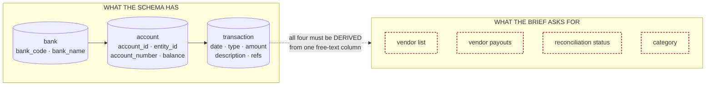
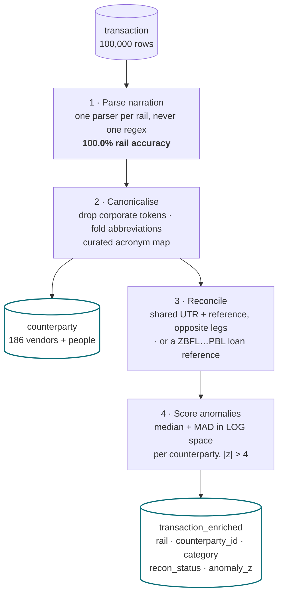
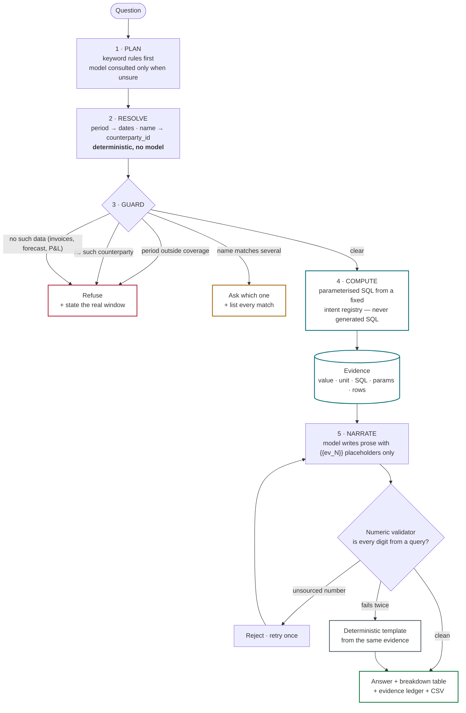
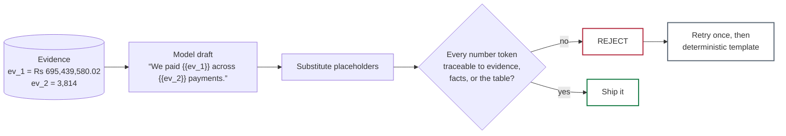
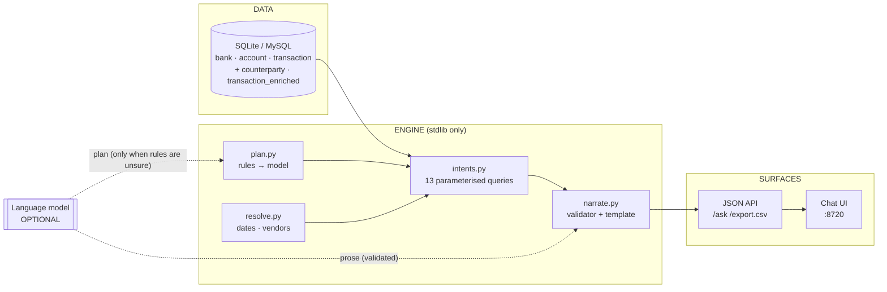

# Architecture

**finassist** — a conversational finance assistant for the TBX schema. A question arrives in
plain English; the engine resolves it to a fixed intent, computes the answer in SQL, and the
language model writes prose around numbers it is structurally incapable of inventing.

The one sentence that describes the whole design:

> **SQL computes. The model only reads the answer out loud — and a validator checks every
> digit against a query result before it reaches the user.**

---

## The problem the schema creates

The brief asks for vendor payouts, reconciliation status and categories. The schema has three
tables and none of those columns:

`description` is the only place a counterparty name exists, and it arrives in nine different
narration formats with the name in a different position in each.

---

## Enrichment — done once, at ingestion

Measured against a held-out answer key the engine never reads:

| | |
|---|---|
| rail classification | **100.000%** |
| counterparty grouping | **99.467%** (1 vendor split, 0 wrongly merged) |
| reconciliation status | **99.990%** |
| category (derived) | **96.227%** |
| unparsed narrations | **0** |

Parsing at ingestion rather than at query time is the point: afterwards, "how much did we pay
Blue Dart last month" is an ordinary indexed `GROUP BY`, so the model never reads a bank
narration string and never touches arithmetic.

---

## Answering a question

**Guards run before compute, not after.** An assistant that computes first and checks second
has already decided what the answer is, and the check becomes a formality.

---

## Why fabrication is impossible, not merely unlikely

The model is forbidden from writing a digit. It must emit `{{ev_3}}`, and the engine
substitutes the computed value. Anything else is rejected.

Verified against five ways a model fabricates — all rejected:

| Draft | Verdict |
|---|---|
| `We paid Blue Dart Rs 4,100,000.00 across {{ev_2}} payments.` | invented a total → **rejected** |
| `We paid {{ev_1}} across {{ev_2}} payments (95% confident).` | invented a confidence → **rejected** |
| `We paid roughly Rs 3.4 million across {{ev_2}} payments.` | rounded to a new number → **rejected** |
| `We paid {{ev_1}} and {{ev_99}} more.` | cited evidence that does not exist → **rejected** |
| `We paid {{ev_1}} across 61 payments.` | invented a count → **rejected** |

`POST /demo/fabrication` runs this live, offline, with no model call — so it cannot flake
during a demo.

---

## System shape

The only third-party dependency in the project is `openai`, and it is needed **only** for the
model. Every number, guardrail, table and CSV export works with a bare Python install.

---

## Model efficiency

| Path | Model calls per question |
|---|---|
| Keyword rules match (the common case) | **0** |
| Rules unsure, or a bare follow-up | 1 planning call (~200 output tokens, JSON) |
| Prose narration, when a key is configured | 1 call (~300 output tokens) |
| Fallback when no key is set | 0 — deterministic template |

The full 20-question answer key scores **20/20 with 0 model calls**. The model improves how
the sentence reads. It cannot change what the number is.
